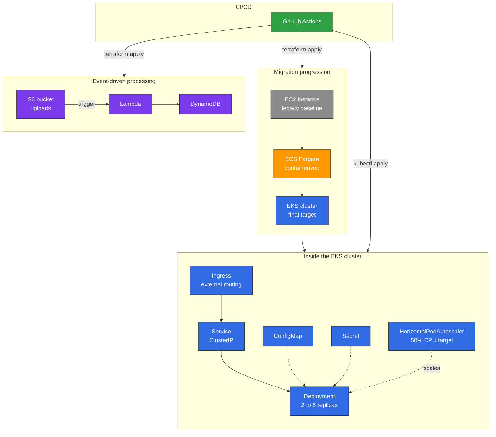

# AWS Migration Toolkit

When I was told, before even starting my apprenticeship, that the team would be focusing on AWS migrations (EC2, ECS, EKS, Lambda, DynamoDB, S3) with Kubernetes and GitHub Actions as the sole CI/CD tool, I wanted to show up ready rather than learn these tools on the job. This project recreates a full cloud migration scenario, from legacy to target platform, covering exactly this stack.

## The scenario

An application starts on a classic EC2 instance (the legacy baseline), moves through ECS Fargate as an intermediate containerization step, then lands on EKS, the final target. In parallel, a Lambda function handles event-driven processing triggered by an S3 upload, with DynamoDB as the data store.



## Why EC2 to ECS to EKS instead of deploying straight to EKS

This is the core of the mission described in the job posting: supporting migrations, not just deploying onto a fresh Kubernetes cluster. A real cloud migration rarely jumps straight from legacy to the final target. It moves through intermediate steps that reduce risk at each stage. Reproducing that progression shows an understanding of the migration process itself, not just the final technology.

## Kubernetes, the six objects that matter

The team flagged six Kubernetes objects as priorities. Here is how each one is actually used in `k8s/base/`.

The Deployment manages replicas and rolling updates for the application.

```yaml
spec:
  replicas: 2
  template:
    spec:
      containers:
      - name: demo-app
        image: nginxdemos/hello:latest
```

The ConfigMap and Secret separate non sensitive configuration (environment variables) from sensitive data (API keys), both mounted into the same pod through envFrom and env.valueFrom.

```yaml
envFrom:
- configMapRef:
    name: demo-app-config
env:
- name: API_KEY
  valueFrom:
    secretKeyRef:
      name: demo-app-secret
      key: api-key
```

The Service exposes the pods internally to the cluster as ClusterIP, and the Ingress routes external traffic to that Service through a hostname.

```yaml
spec:
  ingressClassName: nginx
  rules:
  - host: demo-app.local
    http:
      paths:
      - path: /
        backend:
          service:
            name: demo-app-svc
```

The HorizontalPodAutoscaler watches CPU usage on the pods and automatically adjusts the replica count between 2 and 6 once load crosses 50%.

```yaml
spec:
  minReplicas: 2
  maxReplicas: 6
  metrics:
  - type: Resource
    resource:
      name: cpu
      target:
        averageUtilization: 50
```

All six were tested under real conditions on a local cluster with kind, using an actual nginx Ingress controller and metrics-server so the HPA reads real CPU metrics rather than simulated ones.

## Infrastructure as Code

Each AWS service is an independent Terraform module under `terraform/modules/`, assembled afterward in `terraform/environments/dev`. State is stored remotely on S3 with locking through DynamoDB in `terraform/bootstrap`. This prevents a concurrent terraform apply from corrupting the infrastructure, a standard practice on a team even though this project is solo.

## CI/CD

GitHub Actions automatically validates all seven Terraform modules on every push (fmt, init, validate), catching syntax or formatting errors before any deployment is even attempted.

```yaml
strategy:
  matrix:
    module: [lambda, network, dynamodb, s3, ec2, ecs, eks]
```

## Repository structure
terraform/
bootstrap/ state backend, S3 and DynamoDB lock
modules/ one module per AWS service
environments/ module composition for a given environment
k8s/
base/ the six Kubernetes manifests
lambda/
src/ function code
tests/ unit tests with pytest
.github/workflows/ CI pipelines

## Current status

The infrastructure and code are written, tested, and validated by CI. Actual deployment to AWS is pending account verification, a routine administrative delay for a newly created account. Terraform and Kubernetes are ready to be applied as soon as access is restored.
