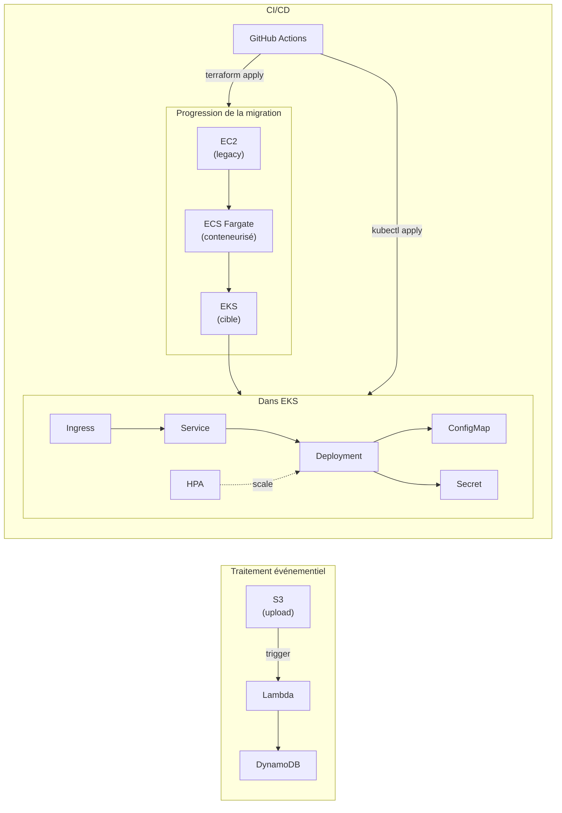

# AWS Migration Toolkit

Quand on m'a annoncé, avant même mon arrivée en alternance, que l'équipe allait se concentrer sur des migrations AWS (EC2, ECS, EKS, Lambda, DynamoDB, S3) avec Kubernetes et GitHub Actions comme unique CI/CD, j'ai voulu arriver prêt plutôt que de découvrir ces outils sur le tas. Ce projet reconstitue un scénario de migration cloud complet, du legacy jusqu'à la cible, en couvrant précisément cette stack.

## Le scénario

Une application part d'une instance EC2 classique (le legacy), passe par ECS Fargate comme étape intermédiaire de conteneurisation, puis atterrit sur EKS, la cible finale. En parallèle, une fonction Lambda gère un traitement événementiel déclenché par un upload S3, avec DynamoDB comme base de données.



## Pourquoi cette progression EC2 → ECS → EKS plutôt qu'un déploiement direct sur EKS

C'est le cœur de la mission décrite dans la fiche de poste : accompagner des migrations, pas juste déployer sur du Kubernetes flambant neuf. Une vraie migration cloud passe rarement d'un legacy directement vers la cible — elle transite par des étapes intermédiaires qui réduisent le risque à chaque saut. Reproduire cette progression montre que je comprends le *process* de migration, pas seulement la techno finale.

## Kubernetes : les six objets qui comptent

L'équipe a listé six objets Kubernetes comme prioritaires. Voici comment chacun est utilisé concrètement dans `k8s/base/` :

**Deployment** — gère les replicas et les rolling updates de l'application :
```yaml
spec:
  replicas: 2
  template:
    spec:
      containers:
      - name: demo-app
        image: nginxdemos/hello:latest
```

**ConfigMap** et **Secret** — séparent la configuration non sensible (variables d'environnement) des données sensibles (clés API), montés tous les deux dans le même pod via `envFrom` et `env.valueFrom` :
```yaml
envFrom:
- configMapRef:
    name: demo-app-config
env:
- name: API_KEY
  valueFrom:
    secretKeyRef:
      name: demo-app-secret
      key: api-key
```

**Service** puis **Ingress** — le Service expose les pods en interne au cluster (`ClusterIP`), l'Ingress route le trafic externe vers ce Service via un nom de domaine :
```yaml
spec:
  ingressClassName: nginx
  rules:
  - host: demo-app.local
    http:
      paths:
      - path: /
        backend:
          service:
            name: demo-app-svc
```

**HorizontalPodAutoscaler** — surveille l'utilisation CPU des pods et ajuste automatiquement le nombre de replicas entre 2 et 6 quand la charge dépasse 50% :
```yaml
spec:
  minReplicas: 2
  maxReplicas: 6
  metrics:
  - type: Resource
    resource:
      name: cpu
      target:
        averageUtilization: 50
```

Les six ont été testés en conditions réelles sur un cluster local (`kind`), avec un vrai contrôleur Ingress nginx et le metrics-server pour que le HPA lise des métriques CPU réelles plutôt que simulées.

## Infrastructure as Code

Chaque service AWS est un module Terraform indépendant (`terraform/modules/`), assemblé ensuite dans `terraform/environments/dev`. Le state est géré à distance sur S3 avec verrouillage via DynamoDB (`terraform/bootstrap`), ce qui évite qu'un `terraform apply` concurrent corrompe l'infrastructure — une pratique standard en équipe, même si ce projet reste solo.

## CI/CD

GitHub Actions valide automatiquement les sept modules Terraform à chaque push (`fmt`, `init`, `validate`), pour attraper les erreurs de syntaxe ou de formatage avant même de tenter un déploiement :

```yaml
strategy:
  matrix:
    module: [lambda, network, dynamodb, s3, ec2, ecs, eks]
```

## Structure du repo
terraform/
bootstrap/ state backend (S3 + DynamoDB lock)
modules/ un module par service AWS
environments/ assemblage des modules pour un environnement donné
k8s/
base/ les six manifests Kubernetes
lambda/
src/ code de la fonction
tests/ tests unitaires (pytest)
.github/workflows/ pipelines CI
## Où en est le projet

L'infrastructure et le code sont écrits, testés et validés par CI. Le déploiement réel sur AWS est en attente de vérification de compte (délai administratif classique pour un compte fraîchement créé) — Terraform et Kubernetes sont prêts à être appliqués dès que l'accès est rétabli.
